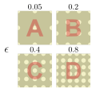
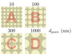
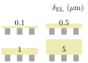
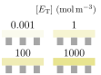

# tikz画廊

## turbulence jet

## three-phase enzymatic reaction system

three-phase system I

cutline

epsilon

dpore

deltaEL

ET

three-phase system II

## neural network

MLP

ReLU

sigmoid

add_backward_propagation

plus_backward_propagation

